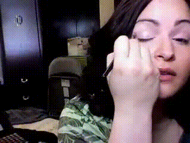
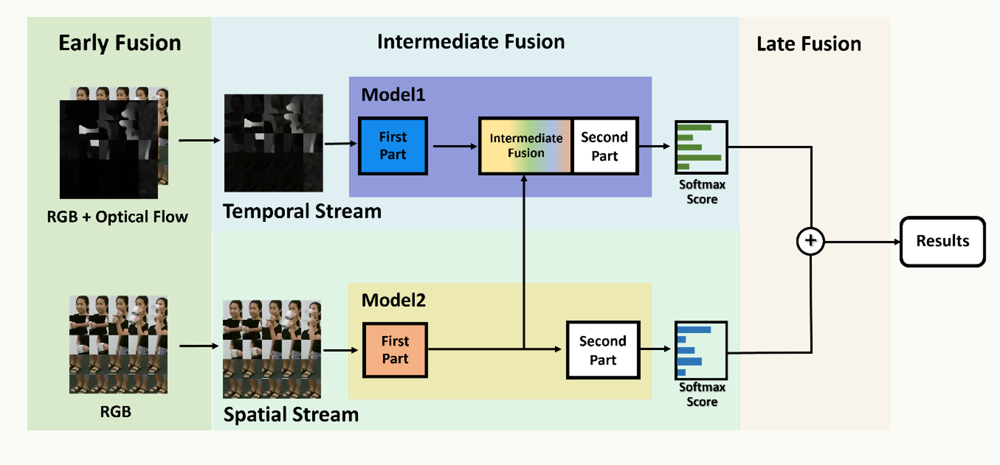
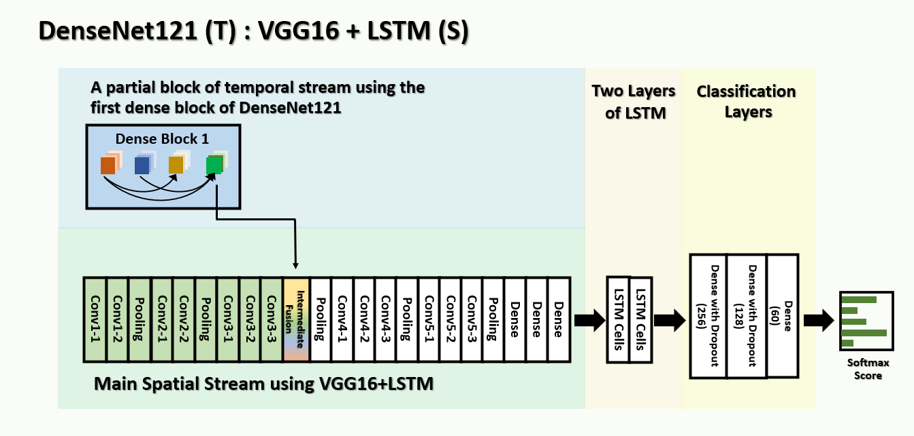
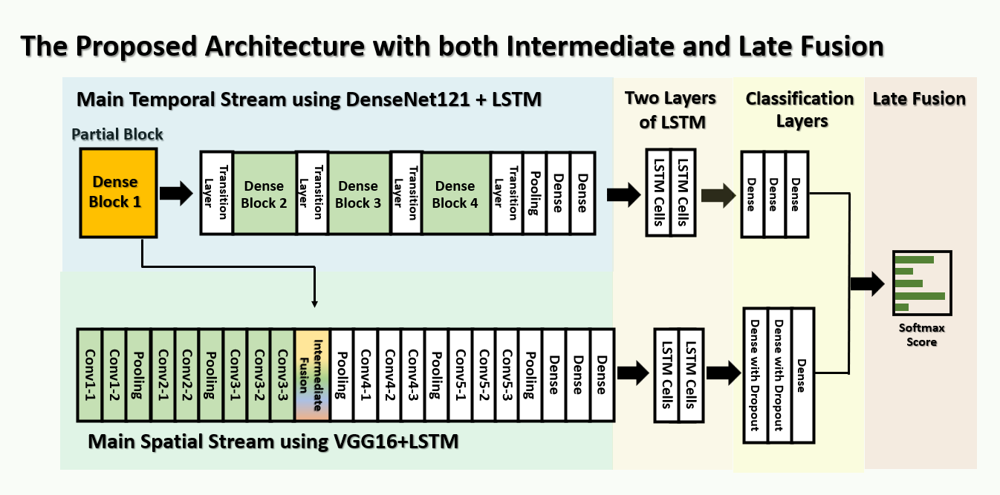

# MFTnet
<p>
  The explanation is during in preparation....  <br />
  Let's us denote <b> S </b> to be a spacial stream, <b> T </b> to be a temporal stream, <b> IF </b> to be an intermedaite fusion module, and <b> LF </b>  to be a late fusion module. <br />
  These videos below show the videos of RGB videos, optical flow videos, and lastly inverted optical flow videos in grayscales. <br />
</p>
<p align="center">  
  
  
  
</p>
  
## Overall Architecture of the MFTnet
The late fusion models consist of 3 methods, which are averaged sum, ridge regression, and multinomial naive bayes.

<p align="center"> 
  
</p>

## Evaluation
Should prepare softmax scores in this formation before performing late fusion:
```Shell
├── SoftMaxScores
    ├── Spatial
        ├── train
        ├── test
    ├── OpticalFlow
        ├── train
        ├── test
    ├── IntermediateFusion
        ├── train
        ├── test
```
Separate Stream
<p align="center"> 
  
|                 Model                   | Spatial Stream (%)| Spatial Stream (%)| 
|:---------------------------------------:|:-----------------:|:-----------------:|
| VGG16                                   |       73.38       |    70.57          |
| DenseNet121                             |       72.68       |    72.23          |
| ResNet18                                |       83.39       |    80.06          |
| EfficientNetB7                          |       87.97       |    84.52          |
| Swin-Transformer-B                      |       76.29       |    75.52          |
| ViT-B-Patch16                           |       71.07       |    65.40          |

</p>

Combined Stream S: (VGG16 + LSTM) + T: (DenseNet121 + LSTM)
| Late Fusion Methods | UCF101 (%) | NTU-RGB 60 (%)| 
|:-------------------:|:--------:|:--------:|
|     Averaged Sum        |   -   |   86.15  |
|    Ridge Regression     |       |   86.17  |
| Multinomial Naive Bayes |       |   86.10  |
| Majority Voting for these 3 Late fusion models |    | 86.21 |

<p align="center"> 
  
</p>

Intermediate Fusion (Fusion inside Model) ()
| Intermediate Fusion Methods | EFFB7(S,T)(4) |  EFFB7(S,T)(5) |  EFFB7(S,T)(6)|  EFFB7(S,T)(7)  | 
|:---------------------------:|:-------------:| :-------------:|:-------------:|:---------------:|
| Sum Fusion                  |      82.03    |       85.20    |      87.69    |      85.89    | 
| Max Fusion                  |      86.59    |       86.56    |      86.93    |      84.38    | 
| Concatenation Fusion        |      83.73    |       85.31    |  **85.20**    |      84.33    | 
| Convolution Fusion          |      83.93    |       86.14    |  **88.46**    |      85.95    | 

Our MFTnet 
<p align="center"> 
  
</p>

|         Models            |   UCF101 (%)  | NTU-RGB 60 (%)| 
|:-------------------------:|:-------------:|:-------------:|
| VGG16 + LSTM (S)          |    -          |     72.04     | 
| DenseNet121 + LSTM (T)    |               |     83.30     |
| Two-Stream with IF        |               |     85.25     |
| Two-Stream with LF        |    -          |     86.15     |
| **MFTnet (Ours)**         |    -          |    **87.93**  |
