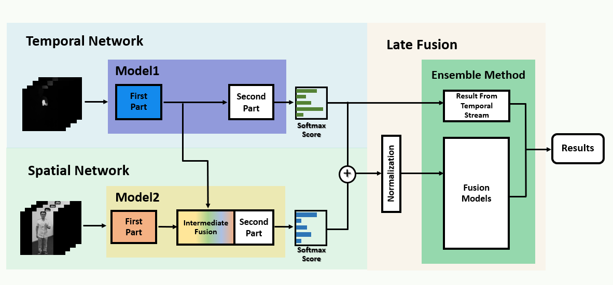

# MFTnet
The explanation is during in preparation....
Optical Flow Videos   

  
  
  
  

  
## Overall Architecture of the MFTnet

 
  

## Results
Separate Stream

 
  
|   Model   | Accuracy (%) | 
|:---------:|:------------:|
| Spatial Stream  (VGG16 + LSTM)         | 88.51  | 
| Temporal Stream (DenseNet121 + LSTM)   | 87.27  |  

Combined Stream S: (VGG16 + LSTM) + T: (DenseNet121 + LSTM)
| Late Fusion Methods | Accuracy (%) | 
|:-----------:|:--------:|
| Averaged Sum | - | 
| Ridge Regression |  |
| Multinomial Naive Bayes |  |
| Majority Voting for these 3 Late fusion models |  |

Intermediate Fusion (Fusion inside Model) ()
| Intermediate Fusion Methods | Accuracy (%)  | 
|:---------------------------:|-------------|
| Sum Fusion                  |  -  |       | 
| Max Fusion                  |     |       |
| Concatenation Fusion        |     |       |
| Convolution Fusion          |   88.69     |

